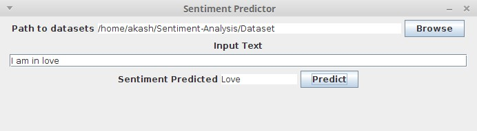

# Sentiment-Analysis
This project aims to develop a sentiment classifier of the twitter data using [Naive Bayes Classifier](https://en.wikipedia.org/wiki/Naive_Bayes_classifier)

### Software Requirements:
- Java

### Overview of the project:
- The twitter raw data was obtained from twitter using twitter api and **Apache Flume**
- This raw data was converted into Dataset using various **Hadoop MapReduce** Jobs
- Using this dataset,a Naive Bayes Classifier was built from scratch
- An UI is also developed using java **JFrame** for easier usage.

- The Classifier classifies the test data into : 
   * Joy
   * Sad
   * Love
   * Anger
   * Suprise

### Contents of this project:

1. **Dataset Folder:** Contains all the dataset files used in the project
2. **Flume Folder:** Contains flume results from twitter
3. **Naive_bayes_Classifier.java:** Contains the source code for the classifier and JFrame
4. **final.jar:** A ready to use and execute jar file(Desktop Application)

### Screenshot:

